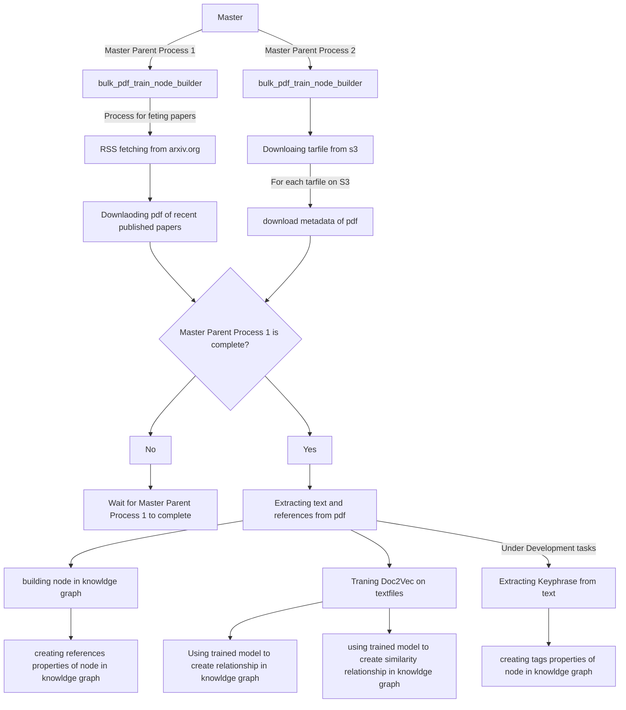

# Recommendation System for Researchkernel 

At reseachkernel we are building knowldge graph storing in a graph database, we use doc2vec by gensim for getting similarity between research papers. Keyphrase Extraction for extracting key words from research papers, and summarizing researhing papers. All these extracted data will be stored into knowldge graph that can be used for multi disciplinary research.

# Project Structure 
```.
├── README.md
├── data
│   ├── daily_update
│   ├── pdf
│   ├── references
│   ├── tar
│   └── text
├── main.py
├── requirements.txt
└── rk_brain
    ├── Utils
    │   ├── __init__.py
    │   ├── clean_metadata.py
    │   └── credentials.py
    ├── __init__.py
    ├── arxiv_db_updater
    │   ├── __init__.py
    │   ├── download_pdf.py
    │   ├── get_s3.py
    │   ├── get_tarfile.py
    │   ├── pdf_metadata_fetcher.py
    │   └── rss_fetcher.py
    ├── contentbased_recsys
    │   └── scripts
    │       ├── clean_metadata.py
    │       ├── database_upload.py
    │       ├── online-tran.py
    │       ├── online_train.py
    │       └── train.py
    ├── etl
    │   ├── __init__.py
    │   └── pdftotext.py
    └── knowldgegraph
        ├── abstract
        │   ├── neo4j_node_builder_abstract.py
        │   └── neo4j_relationship_creator_abstract.py
        ├── neo4j_abstract.py
        ├── neo4j_node_builder.py
        ├── neo4j_relationship_creator.py
        └── update_neo4j.py
```


Project Structure is fairly simple and self explanatory. For understanding checkout the bellow ETL and traning graph.

# How to contribute? 


# Project Workflow Flow 



